# epl-syntax-highlighting README

This is a simple extention that adds syntax highlighting to EPL files. These files are the language used by Apama Streaming Analytics product to create applications (monitors and events) within the correlator component.

For mor information on EPL and Apama please visit the [Apama Community Edition website](http://www.apamacommunity.com/)

## Features

* Enables features for correct versions of Apama.
* Supports EPL language from Apama 10.5.3+
* Support for debugging and launching pure EPL in a correlator.
* Supports apama_project.
* Gives diagnostics from Apama v10.5.3+

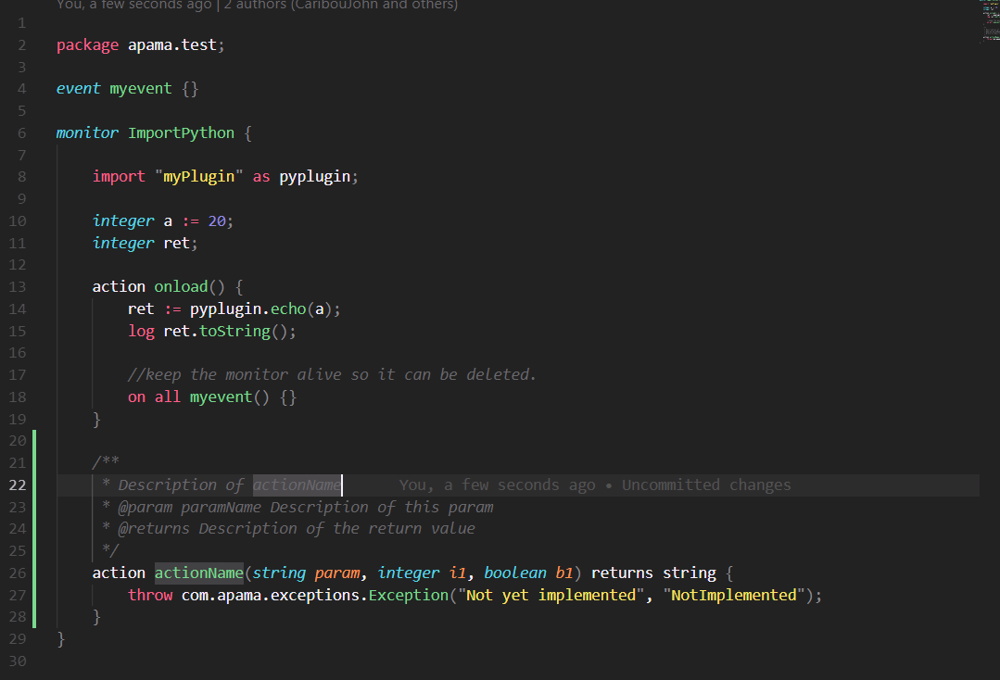

## Settings

## diagnostics

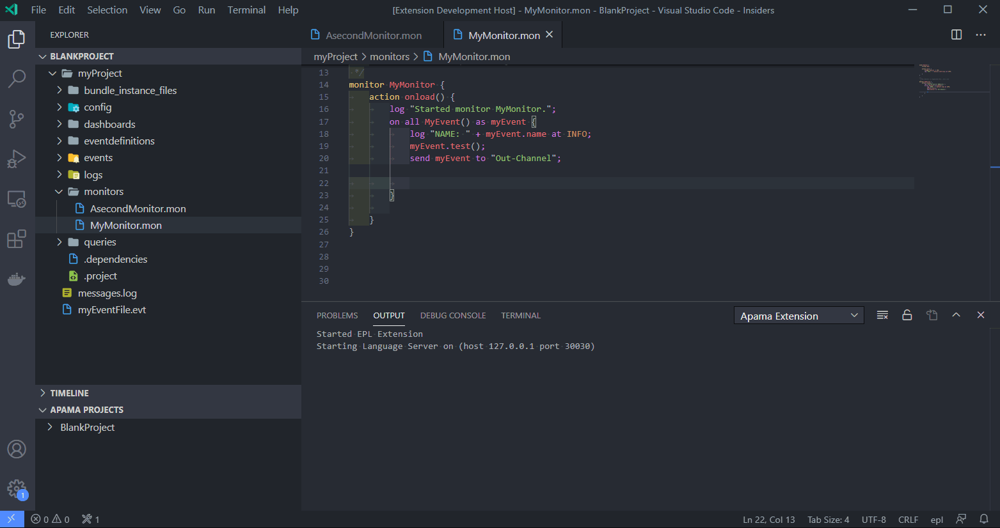

## Snippets

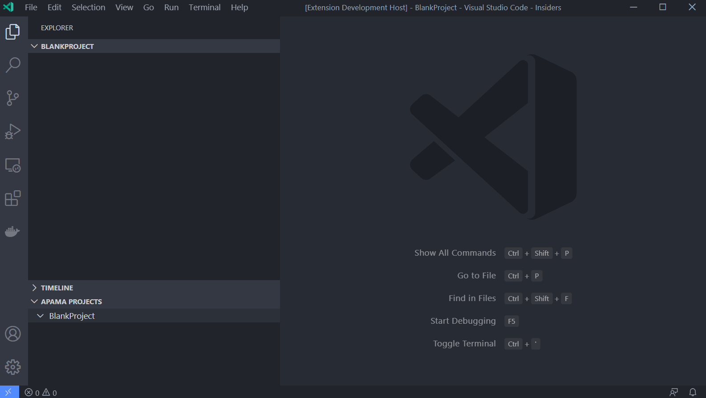

## Correlator Task, inject monitor and send event

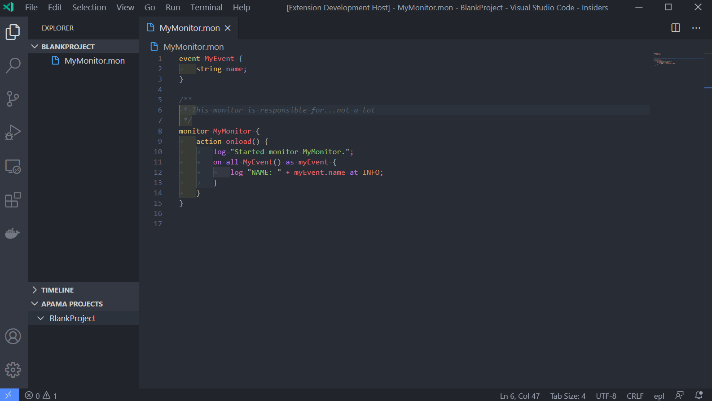

## Send Event file

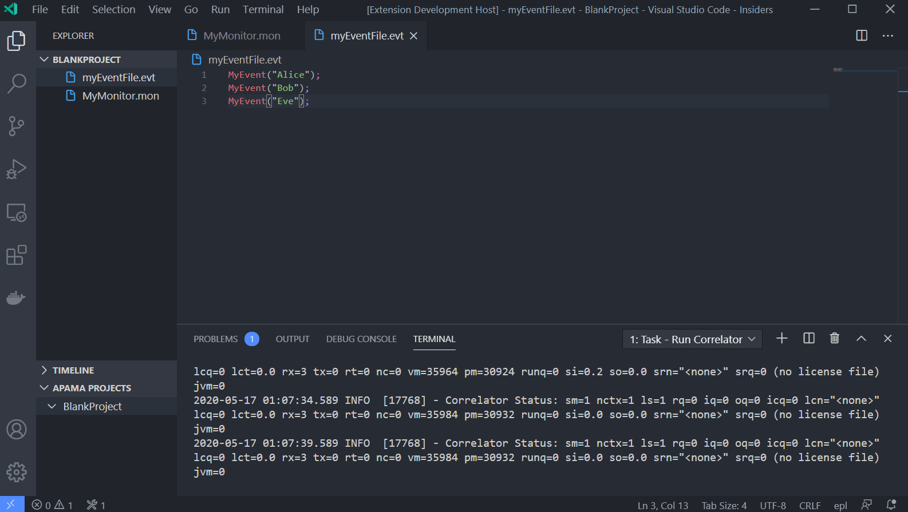

## Create Tasks

## Create Project

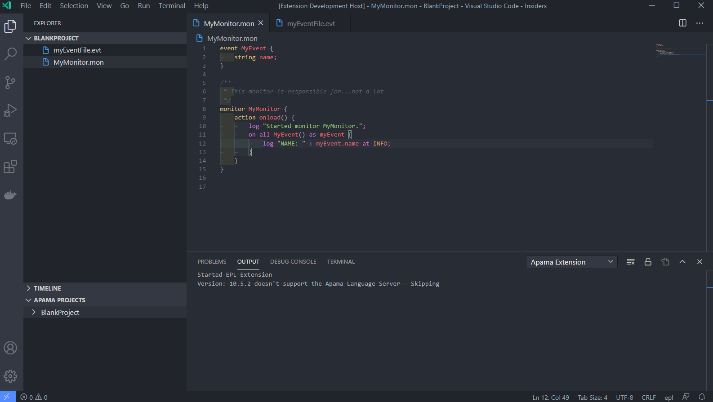

## Add bundles

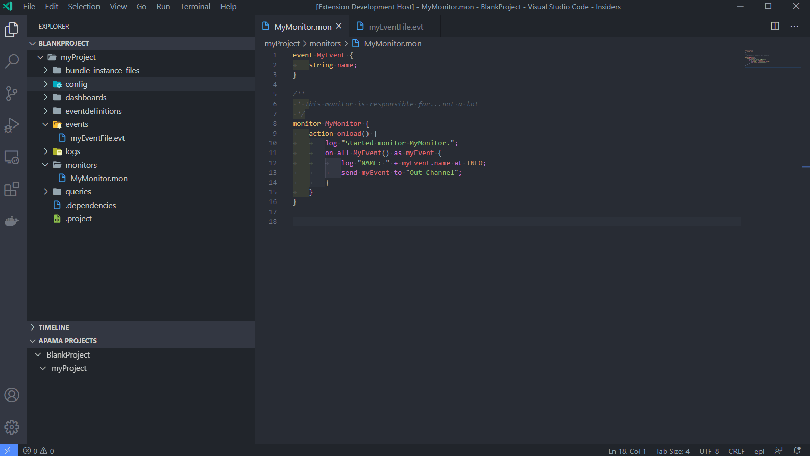

## Remove bundles

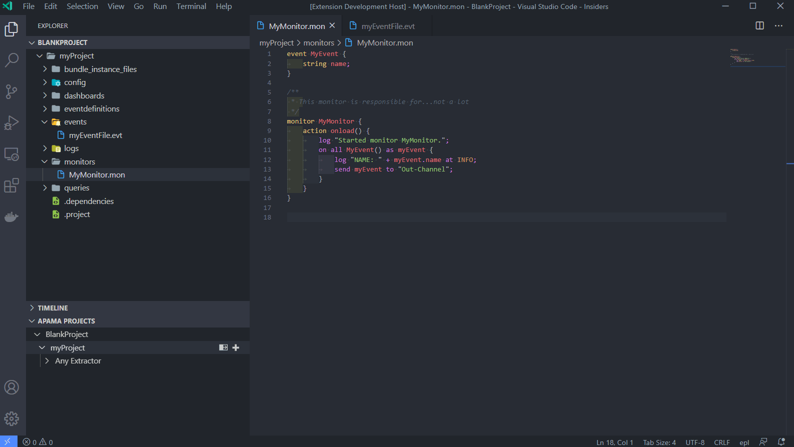

## Deploy project

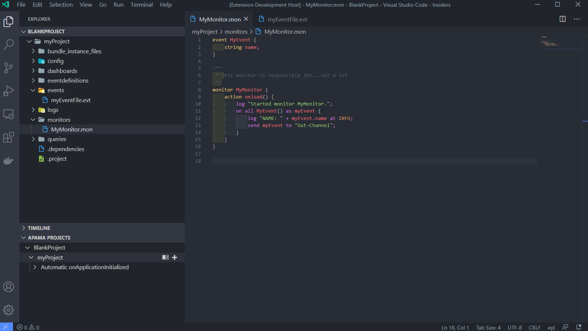

## Add breakpoints

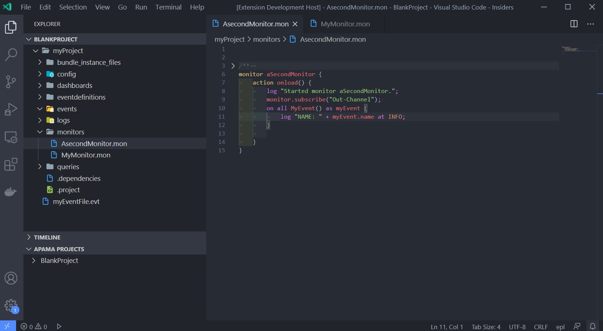

## debug

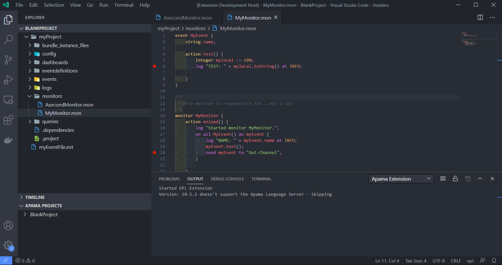

## Requirements

There are no requirements for use of this extention currently.

## Known Issues

TBA

## Development

Users are welcome to make pull requests with fixes and enhancements but I reserve the right to control what and when goes into released versions of the extention.

The syntax highlighting is being adapted from a Javascript syntax file and is being cleaned up and enhanced iteratively. I will eventually have a complete JSON based syntax file for EPL at which point I will probably publish it separately for others to use in the various editors that use the Texmate format. (N.B vscode does have some quirks which will need translating)

## Release Notes

## v1.0

* Finished syntax highlighting
* Documentation
* Apama EPL diagnostics
* Apama project integration

v0.7 - Better syntax highlighting, Snippets, Apama EPL debugging
v0.1 - initial release, basic highlighting support and placeholder for command(s)
